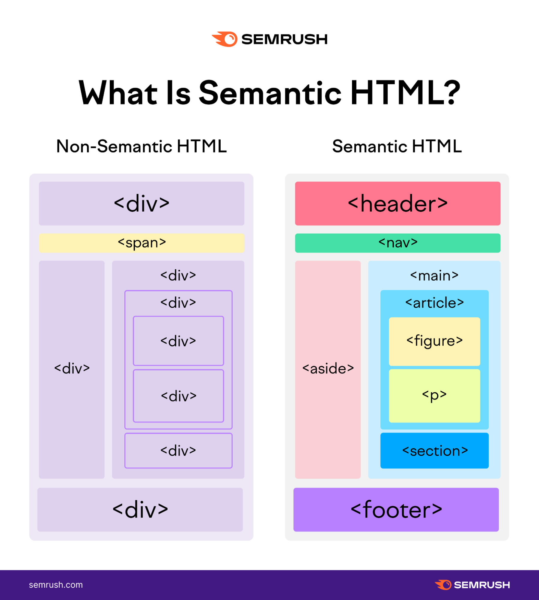

`There are several tags and attributes in HTML that is considered "semantic". It's just a fancy word for meaning that those semantic things have certain purpose. That's important: semantic elements should always make code more easier to understand and it's absolutely essential for screen readers and such.

I found a picture that summarizes my point nicely:

Some developers use only `div`-elements, because it's easy and possible. But it's much more harder to read and understand - for screen readers they are impossible.

> [!NOTE] SEO (Search Engine Optimation)
> Semantics have a great influence to SEO - 
> in other words: Depending on how semantically right your site has been built, Google and other search engines sees that and gives your site better change to been found. Likewise sites that are only 
> div div div are pushed far away from search results.
> **SEO** is one of the most important thing to take account.
> 

___
### The Most Common Tags

So let's get to work and get another look of that picture - especially the right side example.
___

Next chapter:
[[1.1 Header]]`

